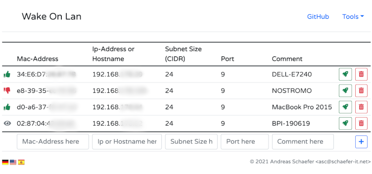

# docker-nginx-php-Wake_on_Lan

This is a docker made to run a simple nginx-php container.
It contains a php file to run a simple Wake on lan tool.

I made the combination of 2 projects to make this.

All info about the php file you can find here:
https://github.com/AndiSHFR/wake-on-lan.php

The base for building this Dockerfile got from here:
https://github.com/johnathanesanders/docker-nginx-fpm

He even got a whole article about it:
https://levelup.gitconnected.com/containerizing-nginx-php-fpm-on-alpine-linux-953430ea6dbc

So all credits to these guys, i just made the combination.